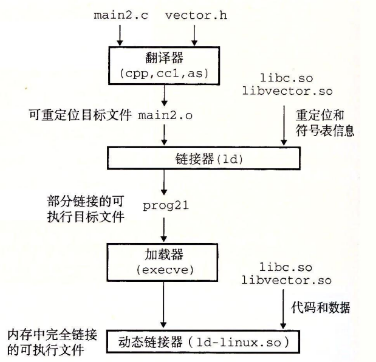

## 参考资料
- [7.10 动态链接共享库](https://hansimov.gitbook.io/csapp/part2/ch07-linking/7.10-dynamic-linking-with-shared-libraries)

## 前置总结
1. 首先同一份动态库在不同程序中使用的虚拟内存空间是不一样的！加载动态库时，动态加载器在程序虚拟空间的文件映射区找到一块空闲的虚拟内存空间，用来承载动态库！
2. 因此，动态库中程序的运行时地址是没有意义的
3. 动态库在编译时无法知道/假设最终的执行地址

## 程序编译加载流程

## 描述
基本的思路是当创建可执行文件时，静态执行一些链接，然后在程序加载时，动态完成链接过程。认识到这一点是很重要的：此时，***没有任何 libvector.so 的代码和数据节真的被复制到可执行文件 prog2l 中***。反之，链接器***复制了一些重定位和符号表信息***，它们使得运行时可以解析对 libvector.so 中代码和数据的引用。

当加载器加载和运行可执行文件 prog2l 时，它利用 7.9 节中讨论过的技术，加载部分链接的可执行文件 prog2l。接着，它注意到 prog2l 包含一个 `.interp` 节，这一节包含***动态链接器***的路径名，***动态链接器本身就是一个共享目标***（如在 Linux 系统上的 ld-linux.so）。 `加载器`不会像它通常所做地那样将控制传递给应用，而是***加载和运行这个动态链接器***。然后，动态链接器通过执行下面的`重定位`完成链接任务：
- 重定位 libc.so 的文本和数据到某个内存段。
- 重定位 libvector.so 的文本和数据到另一个内存段。
- 重定位 prog2l 中所有对由 libc.so 和 libvector.so 定义的符号的引用。

最后，动态链接器将`控制传递给应用程序`。***从这个时刻开始，共享库的位置就固定了***，并且***在程序执行的过程中都不会改变***。

## 装载时重定位

**装载时重定位**（编译时只加-shared）区别于（-shared -fPIC）。装载时重定位，需要修改代码段中的”绝对“地址引用，做不到多个程序共享同一份代码；因此多个程序还是有自己的动态库代码备份，这样就失去了动态链接节省内存的一大优势
## 地址无关码
**地址无关码**（-fPIC）：解决共享对象（动态库本身）指令中对绝对地址的重定位问题，即**把共享对象中那些需要被修改的指令部分【地址相关】分离出来**，跟数据部分放在一起。使用GOT搭桥：将指令部分地址相关的，相对寻址到GOT【GOT的地址得是大致固定的！！！】，再根据GOT寻找到最终的函数或者变量的目标地址

## 全局变量问题
1. 主程序使用共享库中定义的全局变量，且不采用地址无关码选项。由于**主程序的代码在运行时不会重定位**，且**共享库中全局变量的位置是不确定的**。因此，编译链接时只得在主程序自己的BSS段建立一个该全局变量的副本。加载动态库时，要额外查找可执行文件中是否有该变量的副本，如果有的话，要将对应GOT表中的内容指向可执行文件中的副本。
2. 共享对象中定义的全局变量，编译共享对象时，把其当作在其它模块定义的，仍然使用GOT间接访问

